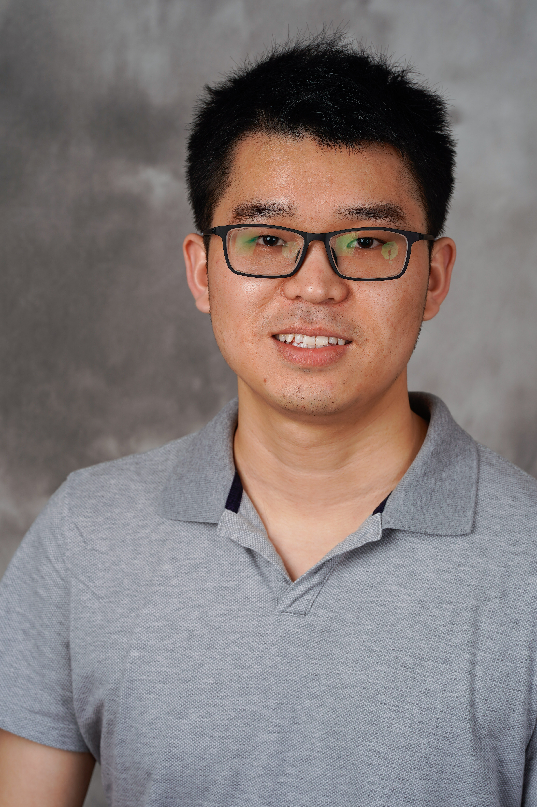

  

Contact Information
====== 

Pulong Ma  
Assistant Professor  
School of Mathematical and Statistical Sciences   
Clemson University  
220 Parkway Drive  
Clemson, SC 29634  
Email: plma [at] clemson.edu  
Office: O-304 Martin Hall  

 

About Me
======

 
 
I am Assistant Professor in the <a href="https://www.clemson.edu/science/departments/math-stat/index.html" target="blank" style="color:blue;">School of Mathematical and Statistical Sciences</a> at <a href="https://www.clemson.edu" target="blank" syle="color:blue;">Clemson University</a> since Fall 2021. Before joining Clemson, I was a postdoctoral fellow at the Statistical and Applied Mathematical Sciences Institute (SAMSI) and Duke University from 2018-2021 mentored by <a href="http://www2.stat.duke.edu/~berger/" target="blank" style="color:blue;">Prof. Jim Berger</a> and <a href="http://www2.stat.duke.edu/~lm186/index.html" target="blank" style="color:blue;">Prof. Li Ma</a>, where I participated in the 2018-2019 research program on Model Uncertainty: Mathematical and Statistical (MUMS).  In 2018, I received my Ph.D. in statistics from University of Cincinnati under the guidance of <a href="https://emilystat.wixsite.com/gdads/" target="blank" style="color:blue;">Prof. Emily Kang</a> and <a href="https://scholar.google.com/citations?user=lqnGbNkAAAAJ&hl=en" target="blank" style="color:blue;">Prof. Bledar Konomi</a> with my dissertation topic in Spatial and Spatio-Temporal Statistics. 

News 
======

 
<ul>
 <li> April 2022, I will give a talk at the <a href="https://www.siam.org/conferences/cm/conference/uq22" target="blank" style="color:blue;" >SIAM Conference on Uncertainty Quantification (UQ22).</a> 
 </li>
 
 <li> April 2022, I will organize a minisymposium on "Bayesian Calibration and Machine Learning Methods for Uncertainty Quantification" at the <a href="https://www.siam.org/conferences/cm/conference/uq22" target="blank" style="color:blue;" >SIAM Conference on Uncertainty Quantification (UQ22)</a>, Atlanta, GA. 
 </li>
 
 <li> March 2022, I will give a virtual talk in the Statistics and Data Science Seminar at Auburn University. </li>
 <li> Starting Jan 2022, I will serve as an Associate Editor for the <em><a href="https://www.springer.com/journal/13253" target="blank" style="color:blue;">Journal of Agricultural, Biological and Environmental Statistics (JABES)</a></em>. </li>
</ul>

