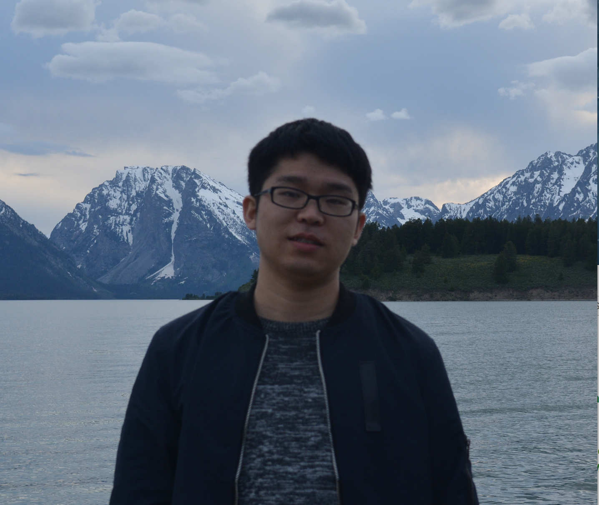

{:width="200px"}  

<h1> <a href="https://drive.google.com/file/d/1CWJgMHzdigze-134ThVYVk3PeMR3jFsT/view?usp=sharing" target="blank">CV </a> </h1>

About Me
======
I am currently a Postdoctoral Fellow at the Statistical and Applied Mathematical Sciences Institute (SAMSI) and Duke University, where I am participating in the program on <a href="https://www.samsi.info/programs-and-activities/year-long-research-programs/model-uncertainty-mathematical-statistical-mums/" target="blank">Model Uncertainty: Mathematical and Statistical</a> (MUMS). I am working on the following areas: 
<ul>
  <li> Uncertainty Quantification (UQ): extrapolation, Gaussian process emulator with physical constraints</li>
  <li> Bayesian methods: Bayesian hierarchical modeling and computation, Bayesian variable selection, scalable Markov chain Monte Carlo methods </li>
  <li> Computer experiments: Bayesian calibration, computer model emulation </li>
  <li> Spatial and spatio-temporal statistics: nonstationary space-time processes, dynamic spatio-temporal models, multivariate models, downscaling, data fusion. </li>
</ul>

In July 2018, I got my Ph.D. in Statistics from University of Cincinnati under the guidance of Dr. Emily L. Kang and Dr. Bledar A. Konomi. During my Ph.D., I have worked on spatial and spatio-temporal statistics with applications in remote-sensing science, climate science, and environmental science. In particular, I developed flexible (e.g., nonstationary and nonseparable) spatial and spatio-temporal process models for massive datasets. I also proposed a statistical downscaling framework to simulate high-resolution geophysical processes with applications in global observing system simulation experiments.    
 

Contact Information
====== 
**Pulong Ma**  
Postdoctoral Fellow  
Statistical and Applied Mathematical Sciences Institute  
4051 Research Commons, Suite 300  
79 T.W. Alexander Drive, P.O. Box 110207  
Durham, NC 27709  
Email: pma [at] samsi.info  
<!-- <a href="http://mapn.github.io/files/PulongMa_CV.pdf" target="blank">Curriculum Vitae</a> -->

Employment
======
* <a href="https://www.samsi.info" target="blank">Statistical and Applied Mathematical Sciences Institute</a>, Durham, NC  
Postdoctoral Fellow, <a href="https://www.samsi.info/programs-and-activities/year-long-research-programs/model-uncertainty-mathematical-statistical-mums/" target="blank">MUMS program</a>, Aug 2018 - Present 
* Duke University, Durham, NC  
Postdoctoral Fellow, Department of Statistical Science, Aug 2018 - Present  
Mentor: Dr. <a href="https://stat.duke.edu/people/james-o-berger" target="blank">James O. Berger</a>

Education
======
* Ph.D. in Statistics, University of Cincinnati, Cincinnati, OH, 2018  
  * Dissertation title: Hierarchical Additive Spatial and Spatio-Temporal Process Models for Massive Datasets
  * Advisors: Dr. <a href="https://emilystat.wixsite.com/gdads/" target="blank">Emily L. Kang</a> and Dr. <a href="https://scholar.google.com/citations?user=lqnGbNkAAAAJ&hl=en" target="blank">Bledar A. Konomi</a>
* B.S. in Computational Mathematics, Northeast Forestry University, China, 2013

